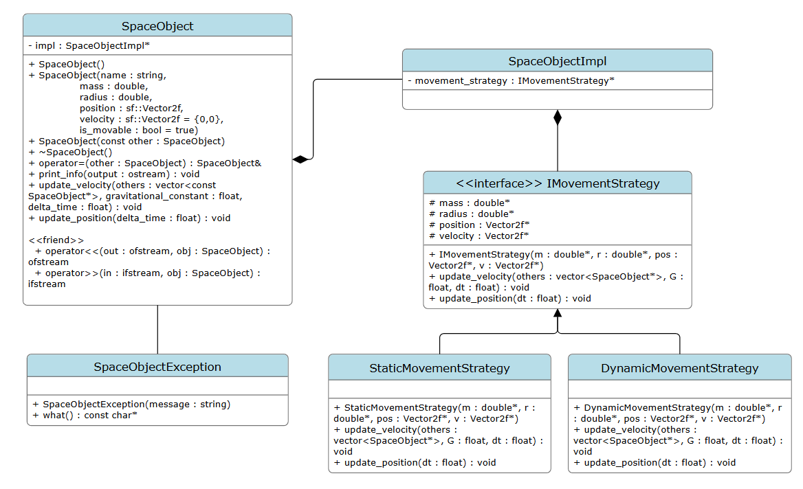

# Space Object Simulation

The final project is a simulation module for space objects, focusing on planet movement. It includes both fun demos, like a Solar System simulation and random object scenarios, where different behaviors are showcased. Link to a video of a demonstration: https://youtu.be/1wfd2mcjHaU?si=MOSo9OklxCWDw5r-

Make sure you have the SFML library installed. Then you can build the module and run the tests on a Windows system by opening a terminal in the project directory and entering the following commands:

```
make all
cd bin
.\test.exe 
.\solar_system.exe
.\random_objects.exe
```

It originally was my personal project for an Individualised Study module "Object-Oriented Programming (C++)" in Vilnius University. Graded by Viktoras Golubevas. Below is a documentation in Lithuanian of my process creating this module.

# Dangaus kūnų simuliacija

## Projekto tikslas: 

Galutinis projekto tikslas yra sukurti modulį, kurio dėka būtų paprasta sukurti aplinką, kuri simuliuotų Saulės sistemos planetų, ar bet kokių kitų dangaus objektų, judėjimą.

## M1 - pirmasis etapas (2025.03.07)

Atlikdamas šią užduotį, sukūriau **klasę** Planet.cpp, kuri apibrėžia planetą su jai būdingais laukais ir metodais. 

### Klasės implementacija

✅ Implementavau **privalomus** bei **papildomus** laukus, užtikrindamas, kad bent vienas jų būtų privalomas.   
✅ Sukūriau **konstruktorius** bei **destruktorių**, kuris užtikrina, kad objektų skaitiklis būtų tinkamai atnaujinamas.    
✅ Kiekvienam planetos objektui automatiškai priskiriamas **unikalus ID**.  
✅ Įdiegiau **statinį lauką**, kuris seka šiuo metu egzistuojančių objektų skaičių.

### Klasės funkcionalumo demonstracija

Norėdamas pademonstruoti sukurtos klasės funkcionalumą, `main()` funkcijoje:

- Ištestavau kiekvieną metodą, kviesdamas jį bent po kartą.
- Sukūriau **statinių** bei **dinaminių** planetų objektų masyvus.
- Kviesdamas metodus, pavaizdavau **būsenų kaitą**.

Visi šie žingsniai leidžia išbandyti ir įvertinti mano sukurtos planetų simuliacijos veikimą.

### Programos paleidimas (M1 ver.)

Programa gali būti paleidžiama nuėjus į projekto katalogą su terminalu ir paleidus šias komandas:

```
make
.\PlanetSimulation.exe
```

## M2 - antrasis etapas (2025.04.04)

### Nauji iššūkiai ir sprendimai
Na, čia jau pradeda kilti tikras kosminis chaosas! Šiame etape nusprendžiau pasinerti į C++ gilumą ir pritaikyti **PIMPL** (Pointer to IMPLementation) idiomą. Kas gi tai? Tai paprasčiausiai reiškia, kad paslėpiau planetų duomenis į atskirą **PlanetImpl** klasę ir viską valdo šios klasės rodyklė. O kas iš to? Ogi mažiau priklausomybės nuo antrinių failų ir patogesnė klasės struktūra!

### Kodėl PIMPL?
Puikus klausimas! Pirmiausia, tai padeda geriau susitvarkyti su priklausomybėmis, nes PlanetImpl klasė gali būti **atskira nuo pagrindinės** Planet klasės. Tai taip pat leidžia lengvai keisti planetų implementaciją, nieko nekeičiant header faile. Be to, tai turi magišką poveikį kompiliavimo laikui, nes bet kokie pokyčiai PlanetImpl **nebepriklauso** nuo header failo.

### Klaidų valdymas
Kaipgi be klaidų? Jei mano planetos masė yra neigiama, tai ji tiesiog negali egzistuoti! Taigi, **sukūriau naują PlanetException klasę**, kuri išmeta išimtį, jei kas nors bando priskirti neigiamą vertę. Tai tikrai geras būdas užtikrinti, kad mano planetos liks stabilios ir neperžengs fizikos dėsnių!

### Dinamika
Kalbant apie dinamines planetas, čia irgi turėjau pasirinkti – naudoti **raw pointers** ar **unique_ptr**. Juk, kaip tikriems kosmoso tyrinėtojams, mums reikia pasirinkti tarp modernių ir šiek tiek senesnių metodų. Pirmiausia parašiau versiją su raw pointers, nes aš tą mėgstu (ir atsimenu visus tuos laikus, kai dar nesinaudojome išmaniosiomis rodyklėmis). O vėliau įdėjau ir unique_ptr versiją – juk niekada nepakenks šiek tiek daugiau šiuolaikinės C++ magijos, ar ne? Taip pat, papildomi taškai taip pat skamba gundančiai!

### Programos paleidimas (M2 ver.)

Programa, nuėjus terminalu į projekto katalogą, gali būti paleidžiama keliais būdais:

1. Sukuriant testinės programos versiją pasinaudojant moduliu, kuris **nenaudoja** išmaniųjų rodyklių:
```
make raw
.\PlanetRawPtrTest.exe
```

2. Sukuriant testinės programos versiją pasinaudojant moduliu, kurio veikimas remiasi moderniomis C++ funkcijomis ir **panaudoja išmaniasias rodykles**:
```
make unique
.\PlanetUniquePtrTest.exe
```

3. Sukuriant tiek pirmame, tiek antrame punkte paminėtus modulius bei programas:
```
make
.\PlanetRawPtrTest.exe
.\PlanetUniquePtrTest.exe
```

## M3 - trečiasis etapas (2025.04.25)

Šiame etape pabaigiau savo modulį, paruošiau jį įtraukimui į kitus projektus, sukūriau dokumentaciją bei pademonstravau jo veikimą.

### Atlikti darbai

✅ Išskaidžiau savo klasę į dvi dalis: **kintamą ir pastovią**. Kintamąjai apibrėžiau abstrakčią klasę IMovementStrategy. 

✅ Interfeisą **išskaidžiau į dvi realizacijas**: StaticMovementStrategy ir DynamicMovementStrategy, kurios pasirenkamos pagal nutylėjimą, tačiau galima keisti realizaciją vykdymo metu.

✅ Įdiegiau galimybę **keisti realizaciją** neprarandant duomenų (abi realizacijos turi bendrą lauką).

✅ **Parašiau operatorius** >> ir <<, leidžiančius išsaugoti ir atkurti objektus iš binarinio failo.

✅ **Papildžiau testus** (failas test.cpp), kurie tikrina, ar realizacijų keitimas ir serializacija veikia tinkamai.

✅ Parašiau **modulio dokumentaciją** ir pasinaudojau Doxygen įrankiu, kad sugeneruoti galutinį PDF. Sukūriau UML klasių diagramą.

✅ Sukūriau **tris** demonstracijas: solar_system.cpp, random_objects.cpp ir test.cpp (pastarasis buvo reikalingas, bet kitus sukūriau asmeniniam malonumui).

### Modulio funkcionalumo demonstracija
**Video**: https://youtu.be/1wfd2mcjHaU

### UML klasių diagrama



### Modulio kompiliavimas ir testų paleidimas (M3 ver.)

Programa gali būti paleidžiama Windows operacinės sistemos įrenginyje nuėjus į projekto katalogą su terminalu ir paleidus šias komandas:

```
make all
cd bin
.\test.exe 
.\solar_system.exe
.\random_objects.exe
```

### Smagaus naudojimo!
